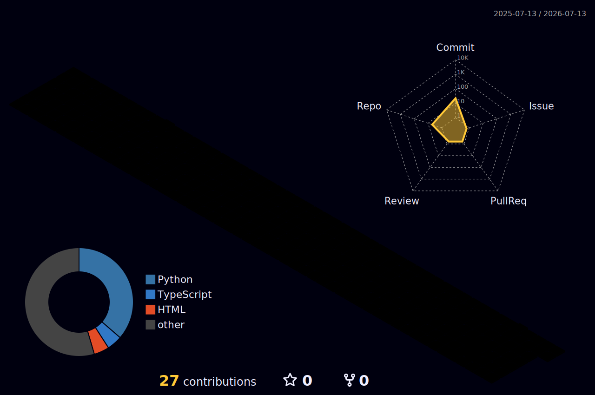

<h1 align="center">Hi 👋, I'm Deep Sengupta</h1>

<h3 align="center">
Artificial Intelligence Engineer | Agentic AI | LLMs | MLOps | Full-Stack Developer
</h3>

<p align="center">
<a href="https://www.linkedin.com/in/deep-sengupta-573363229/">

</a>

<a href="https://portfolio-website-8efi.onrender.com/">

</a>

<a href="mailto:senguptadeep03@gmail.com">

</a>
</p>

<p align="center">

</p>

---

# 🎯 About Me

```yaml
name: Deep Sengupta
location: Kolkata, India
role: Artificial Intelligence Engineer @ AMI
education: B.Tech CSE (AI), IEM Kolkata
cgpa: 9.64/10

focus:
  - Agentic AI
  - Large Language Models
  - RAG Systems
  - LLMOps & MLOps
  - Cloud Native Applications

current_learning:
  - LLM Fine-Tuning
  - Multi-Agent Systems
  - MCP Servers
  - Enterprise AI Architecture
  - Distributed AI Systems
```

🤖 Building production-grade AI systems and agentic workflows

🚀 Working on LLMs, LangGraph, RAG, MLOps and AI Infrastructure

🏆 3× Academic Excellence Award Recipient

📚 Published AI Researcher

📜 Patent Inventor

---

# 💼 Experience

### Artificial Intelligence Engineer | American Megatrends International (AMI)

- Built Agentic AI workflows using LangChain & LangGraph
- Developed enterprise AI automation solutions
- Deployed scalable Docker & Kubernetes microservices
- Integrated OpenBMC and Redfish APIs
- Designed production-grade AI systems

---

# 🏅 Career Highlights

🏆 3× Academic Excellence Award Recipient

📚 IEEE Published Researcher

📜 Patent Inventor

🥇 Madhyamik Rank 11 in West Bengal

🎯 JEE Main 95.85 Percentile

🎓 CGPA 9.64/10

🤖 Artificial Intelligence Engineer @ AMI

🏅 Director's Choice Award

---

---

# 🚀 Featured Projects

## 🤖 DeepRAGfolio

Agentic AI Portfolio Assistant with RAG, Tool Calling, Voice Search and Conversational Memory.

**Tech Stack:** LangChain • FastAPI • Docker • Gemini • Node.js

---

## 🛡️ Meridian DCM SRCS

Zero Trust Hardware Management Platform with Redfish Telemetry, TPM Security and Secure Remote Command Execution.

**Tech Stack:** Kubernetes • Python • React • C++

---

## 🎙️ Audio Deepfake Detection

CNN-based Deepfake Detection System with 94% Accuracy.

**Tech Stack:** Python • TensorFlow • Flask • Deep Learning

---

## ♻️ SustAIble

Generative AI Platform for Sustainable Manufacturing and Circular Economy.

**Tech Stack:** Generative AI • ML • ESG Analytics

---

# 💻 Tech Stack

### 🤖 AI / ML / LLMs


### ⚙️ Backend & APIs


### 🌐 Frontend


### ☁️ Cloud & DevOps


### 🗄️ Databases


### 🛠️ Tools & Platforms


### 💻 Languages


---


# 🧠 AI Skills Matrix

| Area | Technologies |
|--------|-------------|
| Agentic AI | LangGraph, LangChain |
| LLMs | OpenAI, Gemini, Ollama |
| RAG | Vector Databases, Embeddings |
| MLOps | MLflow, Airflow |
| Deployment | FastAPI, Docker, Kubernetes |
| Infrastructure | OpenBMC, Redfish |
| Databases | PostgreSQL, MongoDB |
| Cloud | AWS |

---

# 📊 GitHub Analytics

<p align="center">

</p>

<p align="center">

</p>

<p align="center">

</p>

---


# 📈 Contribution Graph

[](https://github.com/12021003012)

---

# 📊 Engineering Dashboard

| Category | Details |
|-----------|-----------|
| 🔭 Currently Building | Agentic AI Systems |
| 🌱 Learning | LLM Fine-Tuning, MCP Servers |
| ☁️ Cloud | AWS, Docker, Kubernetes |
| 🤖 AI Focus | LangGraph, RAG, Multi-Agent Systems |
| 🏢 Company | American Megatrends International (AMI) |
| 🎯 Goal | Building Production-Grade Enterprise AI Systems |

---

# 🏆 GitHub Trophies

<p align="center">

</p>

---


# 💎 GitHub Dashboard


---

# 🐍 Contribution Snake

<p align="center">
  
</p>

---

# 📊 GitHub Metrics


---

# 🌌 3D Contribution Calendar



---
# ⏱ Weekly Development Breakdown

```text
Python        ████████████████░░░░░ 65%
TypeScript    ██████░░░░░░░░░░░░░░░ 20%
Docker        ███░░░░░░░░░░░░░░░░░░ 10%
Kubernetes    ██░░░░░░░░░░░░░░░░░░░ 5%

---

⭐ If you like my work, consider starring my repositories!
